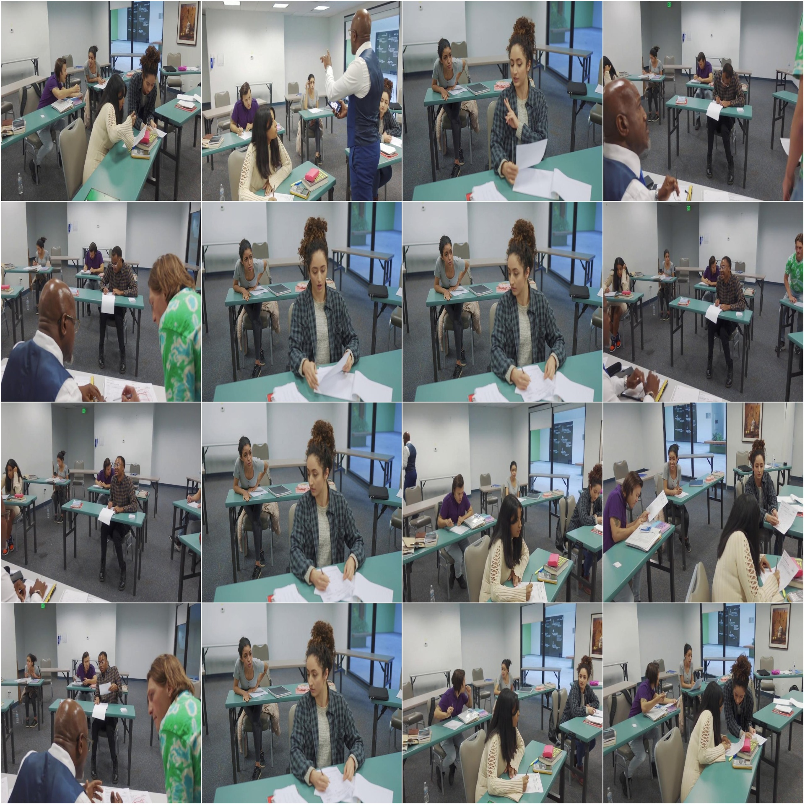
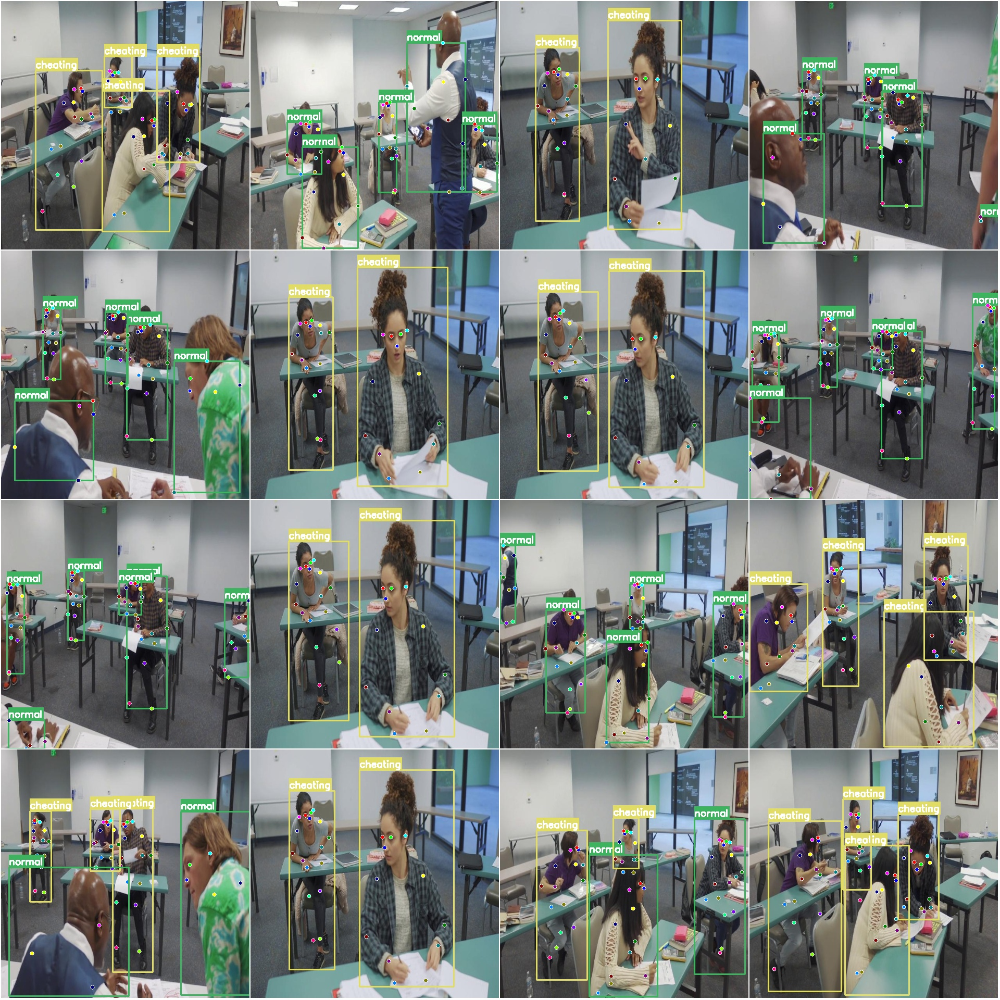

# Examination Classroom Behavior Key Point Estimation Detection Dataset COCO + YOLO Format: 1738 Images in Two Categories, 17 Keypoints

Dataset format: YOLO keypoint format (Note that this is not the target detection or segmentation YOLO format, it only contains jpg images and corresponding yolo format txt files).
Number of images (number of jpg files): 1738
Number of annotations (number of txt files): 1738
Training set size: 1432
Validation set size: 203
Test set size: 103
Number of annotation categories: 2
Annotation category names: ['cheating', 'normal']
Number of keypoints to be annotated: 17
Keypoint names: ["nose", "left_eye", "right_eye", "left_ear", "right_ear", "left_shoulder", "right_shoulder", "left_elbow", "right_elbow", "left_wrist", "right_wrist", "left_hip", "right_hip", 
"left_knee", "right_knee", "left_ankle", "right_ankle"]
Each category annotated with boxes:
Cheating box count = 2932
Normal box count = 4513
Total box count = 7445
Image resolution: 640x640
Important note: The dataset has been divided into training, validation, and test sets. You can directly use this dataset for training models like YOLOv5-Pose or YOLOv8-Pose or YOLOv11-Pose or 
YOLOv26-Pose.
Special declaration: This dataset does not guarantee the accuracy of the trained model or weight files.
Image preview:
Annotation example:
Randomly selected 16 images:
Annotation drawing result:

## Images

Here is a pay link on Stripe ( https://buy.stripe.com/3cs8yP7sY87d0vu9AB ). Please contact me lonlonago@foxmail.com after funding $89, and I will send you a complete data files , thank you!

